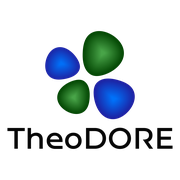

TheoCP2K
--------

.. image:: https://github.com/mattiamerlo-bot/TheoCP2K/actions/workflows/appimage.yml/badge.svg
   :target: https://github.com/mattiamerlo-bot/TheoCP2K/actions/workflows/appimage.yml
   :alt: Linux AppImage build

**TheoCP2K** is a CP2K TDDFPT/NTO-cube extension of TheoDORE. It retains the
upstream TheoDORE sources and adds a standalone graphical workflow for CP2K
``.out`` and ``.cube`` files.

Latest version
~~~~~~~~~~~~~~

The current stable version is
`TheoCP2K v0.1.0 <https://github.com/mattiamerlo-bot/TheoCP2K/releases/tag/v0.1.0>`_.
It introduces version 2 project files, which retain completed Omega maps and
their analysed descriptors when a project is saved and reopened.

The latest tested development version is always the tip of
`main <https://github.com/mattiamerlo-bot/TheoCP2K/tree/main>`_. Its Linux
AppImage is available from the
`latest successful AppImage workflow <https://github.com/mattiamerlo-bot/TheoCP2K/actions/workflows/appimage.yml?query=branch%3Amain+is%3Asuccess>`_.

Stable versions are published on the
`releases page <https://github.com/mattiamerlo-bot/TheoCP2K/releases>`_. The
`latest tagged release <https://github.com/mattiamerlo-bot/TheoCP2K/releases/latest>`_
contains ``TheoCP2K-x86_64.AppImage`` and ``SHA256SUMS.txt`` whenever at least
one ``v*`` tag has been created.

The **TheoDORE** (Theoretical Density, Orbital Relaxation and Exciton analysis) package is a program suite for the analysis of excited states obtained from quantum chemical excited state calculations.

*Author*: Felix Plasser

*Contributors*: Ljiljana Stojanovic, Gunter Hermann, Sebastian Mai, Maximilian F.S.J. Menger, Patrick Kimber, Dong Xing, Sayan Ghosh

TheoDORE is distributed under the GNU General Public License 3.0 (see `LICENSE.txt <https://github.com/felixplasser/theodore-qc/blob/master/LICENSE.txt>`_).

*Main citation for TheoDORE*: F. Plasser, `"TheoDORE: A toolbox for a detailed and automated analysis of electronic excited state computations" <https://doi.org/10.1063/1.5143076>`_,
*J. Chem. Phys.*, (**2020**), 152, 084108.
More literature, regarding the individual implemented methods, is given in the header file when calling TheoDORE.

Documentation
~~~~~~~~~~~~~
* `Documentation of TheoDORE 3 <https://theodore-qc.sourceforge.io/docs/contents.html>`_

For user support, please use the `forum <https://sourceforge.net/p/theodore-qc/discussion/>`_.

For bugs / feature requests, please use the `issues page <https://github.com/felixplasser/theodore-qc/issues>`_.

Installation
~~~~~~~~~~~~
* You can obtain the newest TheoDORE release from `github releases <https://github.com/felixplasser/theodore-qc/releases>`_.
* Alternatively, to get the current development version of the code and test suite, run

::

    git clone --recursive https://github.com/felixplasser/theodore-qc.git
    git clone https://github.com/felixplasser/theodore-test.git

* To run TheoDORE, setup ``PATH`` and ``PYTHONPATH`` as explained in the `installation instructions <https://theodore-qc.sourceforge.io/docs/installation.html>`_.

Usage
~~~~~
A detailed description of the usage is given `here <https://theodore-qc.sourceforge.io/docs/usage.html>`_.

* As opposed to earlier versions, TheoDORE 3 is activated with a central driver script ``theodore``.
* To get a list of all implemented options simply type

::

    theodore -h

* For input generation

::

    theodore theoinp

* Analysis of transition density matrices

::

    theodore analyze_tden

CP2K TDDFPT NTO cube GUI
~~~~~~~~~~~~~~~~~~~~~~~~

This fork adds a memory-bounded CP2K ``.out``/NTO ``.cube`` workflow and a
desktop GUI with editable molecular fragments, state assignment, fragment
electron-hole maps, and 3-D NTO display::

    python -m theodore.cp2k_cube.gui

or, after installation::

    theodore-cp2k-gui

See ``CP2K_CUBE_GUI.md`` for installation, CP2K input, the exact filename
convention, output formats, and the scientific scope of cube-derived
descriptors.

Linux AppImage
~~~~~~~~~~~~~~

Every push to ``main`` builds and tests a self-contained x86_64 AppImage in
GitHub Actions. Download ``TheoCP2K-Linux-x86_64`` from the latest successful
workflow run, extract the artifact, and run::

    chmod +x TheoCP2K-x86_64.AppImage
    ./TheoCP2K-x86_64.AppImage

On systems without FUSE, use::

    APPIMAGE_EXTRACT_AND_RUN=1 ./TheoCP2K-x86_64.AppImage

After a successful build on ``main``, the first commit carrying a new version
in ``VERSION`` automatically creates the matching GitHub Release with the
AppImage and ``SHA256SUMS.txt``. A tag named ``v*`` can also trigger release
publication. Build details and local instructions are in
``packaging/appimage/README.md``.

External libraries
~~~~~~~~~~~~~~~~~~

*Libraries distributed along with TheoDORE are listed below.*

TheoDORE uses the `cclib library <http://cclib.github.io>`_ for some of its file parsing work.
cclib is distributed under a BSD 3-Clause License, see cclib/LICENSE .
Copyright (c) 2017, the cclib development team.
Citation for cclib:
N. M. O'Boyle, A. L. Tenderholt, K. M. Langner, *J. Comput. Chem.* (**2008**), 29, 839.

TheoDORE uses `periodictable <https://github.com/pkienzle/periodictable>`_ in connection with cclib.

TheoDORE uses `colt <https://github.com/mfsjmenger/colt>`_ for its commandline interface.
colt is distributed under the Apache License 2.0.

*Optional libraries that can be interfaced with TheoDORE*

TheoDORE uses `Open Babel <http://openbabel.org/>`_ for reading chemical structure files.
Open Babel is distributed under a GPL license. Install Open Babel if you want to use this functionality.
Citation for Open Babel:
N. M. O'Boyle, M. Banck, C. A. James, C. Morley, T. Vandermeersch, and G. R. Hutchison, *J. Cheminf.* (**2011**), 3, 33.

TheoDORE uses `ORBKIT <http://orbkit.github.io/>`_ for visualization of orbitals and densities.
ORBKIT is distributed under an LGPL license. Install orbkit if you want to use this functionality.
Citation for ORBKIT:
G. Hermann, V. Pohl, J. C. Tremblay, B. Paulus, H.-C. Hege, A. Schild, *J. Comput. Chem.* (**2016**), 37, 1511.

Disclaimer
~~~~~~~~~~

THIS SOFTWARE IS PROVIDED BY THE COPYRIGHT HOLDERS AND CONTRIBUTORS "AS IS"
AND ANY EXPRESS OR IMPLIED WARRANTIES, INCLUDING, BUT NOT LIMITED TO, THE
IMPLIED WARRANTIES OF MERCHANTABILITY AND FITNESS FOR A PARTICULAR PURPOSE ARE
DISCLAIMED. IN NO EVENT SHALL THE COPYRIGHT HOLDER OR CONTRIBUTORS BE LIABLE
FOR ANY DIRECT, INDIRECT, INCIDENTAL, SPECIAL, EXEMPLARY, OR CONSEQUENTIAL
DAMAGES (INCLUDING, BUT NOT LIMITED TO, PROCUREMENT OF SUBSTITUTE GOODS OR
SERVICES; LOSS OF USE, DATA, OR PROFITS; OR BUSINESS INTERRUPTION) HOWEVER
CAUSED AND ON ANY THEORY OF LIABILITY, WHETHER IN CONTRACT, STRICT LIABILITY,
OR TORT (INCLUDING NEGLIGENCE OR OTHERWISE) ARISING IN ANY WAY OUT OF THE USE
OF THIS SOFTWARE, EVEN IF ADVISED OF THE POSSIBILITY OF SUCH DAMAGE.
